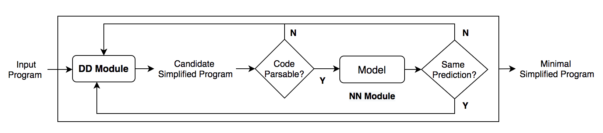
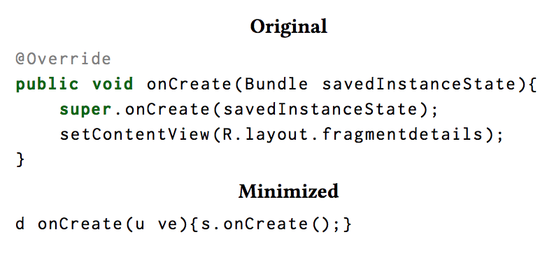
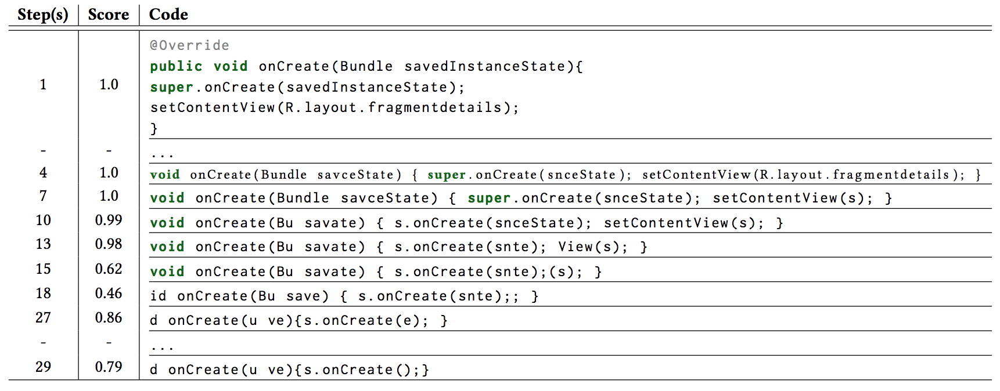
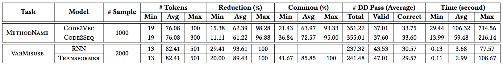

## SIVAND: Prediction-Preserving Program Simplification

This repository contains the code of prediction-preserving simplification and the simplified data using DD module for our paper '[Understanding Neural Code Intelligence Through Program Simplification](https://arxiv.org/abs/2106.03353)' accepted at [ESEC/FSE'21](https://2021.esec-fse.org/details/fse-2021-papers/9/Understanding-Neural-Code-Intelligence-through-Program-Simplification).

Artifact for Article (SIVAND): https://dl.acm.org/do/10.1145/3462296/

---

## Structure

```
├── ./                     # code for model-agnostic DD framework
├── data/
    ├── selected_input     # randomly selected test inputs from different datasets
    ├── simplified_input   # traces of simplified inputs for different models
    ├── summary_result     # summary results of all experiments as csv
├── models/
    ├── dd-code2seq        # DD module with code2seq model
    ├── dd-code2vec        # DD module with code2vec model
    ├── dd-great           # DD module with RNN/Transformer model
├── others/                # related helper functions
├── save/                  # images of SIVAND
``` 

---

## Workflow

||
:-------------------------:

[Delta Debugging (DD)](https://www.st.cs.uni-saarland.de/dd/) was implemented with Python 2. We have modified the core modules ([DD.py](https://www.st.cs.uni-saarland.de/dd/DD.py), [MyDD.py](https://www.st.cs.uni-saarland.de/dd/MyDD.py)) to run in [Python 3](https://github.com/mdrafiqulrabin/dd-py3) (i.e., Python 3.7.3), and then adopted the DD modules for prediction-preserving program simplification using different models. The approach, SIVAND, is model-agnostic and can be applied to any model by loading a model and making a prediction with the model for a task.

**How to Start**: 
To apply SIVAND (for MethodName task as an example), first update `<g_test_file>` (path to a file that contains all selected inputs) and `<g_deltas_type>` (select token or char type delta for DD) in `helper.py`. 
Then, modify `load_model_M()` to load a target model (i.e., code2vec/code2seq) from `<model_path>`, and `prediction_with_M()` to get the predicted name, score, and loss value with `<model>` for an input `<file_path>`. 
Also, check whether `<code>` is parsable into `is_parsable()`, and load method by language (i.e. Java) from `load_method()`.
Finally, run `MyDD.py` that will simplify programs one by one and save all simplified traces in the `dd_data/` folder. 

**More Details**: 
Check `models/dd-code2vec/` and `models/dd-code2seq/` folders to see how SIVAND works with code2vec and code2seq models for MethodName task on Java program. 
Similarly, for VarMisuse task (RNN & Transformer models, Python program), check the `models/dd-great/` folder for our modified code.

---

## Motivating Example

|||
:-------------------------:|:-------------------------:
|Example of an original and minimized method in which the target is to predict `onCreate`.| Reduction of a program while preserving the predicted method name `OnCreate` by the code2vec model.|

The minimized example clearly shows that the model has learned to take shortcuts, in this case looking for the name in the function's body.

---

## Experimental Settings

  * Tasks:
    * [MethodName (MN)](https://arxiv.org/abs/1602.03001)
    * [VarMisuse (VM)](https://arxiv.org/abs/1904.01720)

  * Models:
    * [MN] [code2vec](https://github.com/tech-srl/code2vec/) & [code2seq](https://github.com/tech-srl/code2seq/)
    * [VM] [RNN & Transformer](https://github.com/VHellendoorn/ICLR20-Great)

  * Datasets:
    * [MN] [Java-Large](https://github.com/tech-srl/code2seq/#java)
    * [VM] [Py150](https://github.com/google-research-datasets/great)

  * Sample Inputs:
    * [MN] Correctly predicted samples, Wrongly predicted samples
    * [VM] Buggy (correct location and target; wrong location), Non-buggy (bug-free)

  * Delta Types:
    * [MN] Token & Char
    * [VM] Token

---

## Results

The `data/summary_result/` folder contains summary results of all experiments as csv, each file has the following fields:

* `filename`: ID for the input file of `data/simplified_input` folder
* `model`: {code2vec, code2seq, RNN, or Transformer}
* `task`: METHOD_NAME or VARIABLE_MISUSE
* `filter_type`: 
  *  {token_correct, char_correct or token_wrong} for task == METHOD_NAME
  *  {buggy_correct, non_buggy_correct, or buggy_wrong_location} for task == VARIABLE_MISUSE
* `initial_score`: score of actual program
* `final_score`: score of minimal program
* `initial_loss`: loss of actual program
* `final_loss`: loss of minimal program
* `dd_pass`: total/valid/correct DD stepss for reduction
* `dd_time`: total time spent for reduction
* `initial_program`: actual raw program
* `final_program`: minimal simplified program
* `initial_tokens`: tokens in actual program
* `final_tokens`: tokens in minimal program
* `len_{initial/final/minimal}_{tokens/chars}`: number of corresponding {tokens/chars}
* `per_removed_{chars/tokens}`: percentage of removed {chars/tokens}
* `attn_nodes`: top-k AST nodes based on attention score {k ~= len_final_nodes}
* `final_nodes`: all AST nodes in minimal program
* `common_nodes`: common nodes between attention & reduction
* `len_{attn/final/common}_nodes`: number of corresponding AST nodes
* `per_common_tokens`: percentage of common nodes between attention & reduction
* `ground_truth`: True (for correct prediction) or False (for wrong prediction)

Note that the `<null>`, `-1`, or `<empty>` value represents that the value is not available for that particular input/experiment.


||
:-------------------------:
|Summary of reduction results in correctly predicted samples.|

---

# Citation:

[Understanding Neural Code Intelligence through Program Simplification](https://dl.acm.org/doi/10.1145/3468264.3468539)

```
@inproceedings{rabin2021sivand,
  author = {Rabin, Md Rafiqul Islam and Hellendoorn, Vincent J. and Alipour, Mohammad Amin},
  title = {Understanding Neural Code Intelligence through Program Simplification},
  year = {2021},
  isbn = {9781450385626},
  publisher = {Association for Computing Machinery},
  address = {New York, NY, USA},
  url = {https://doi.org/10.1145/3468264.3468539},
  doi = {10.1145/3468264.3468539},
  booktitle = {Proceedings of the 29th ACM Joint Meeting on European Software Engineering Conference and Symposium on the Foundations of Software Engineering},
  pages = {441–452},
  numpages = {12},
  location = {Athens, Greece},
  series = {ESEC/FSE 2021}
}
```
